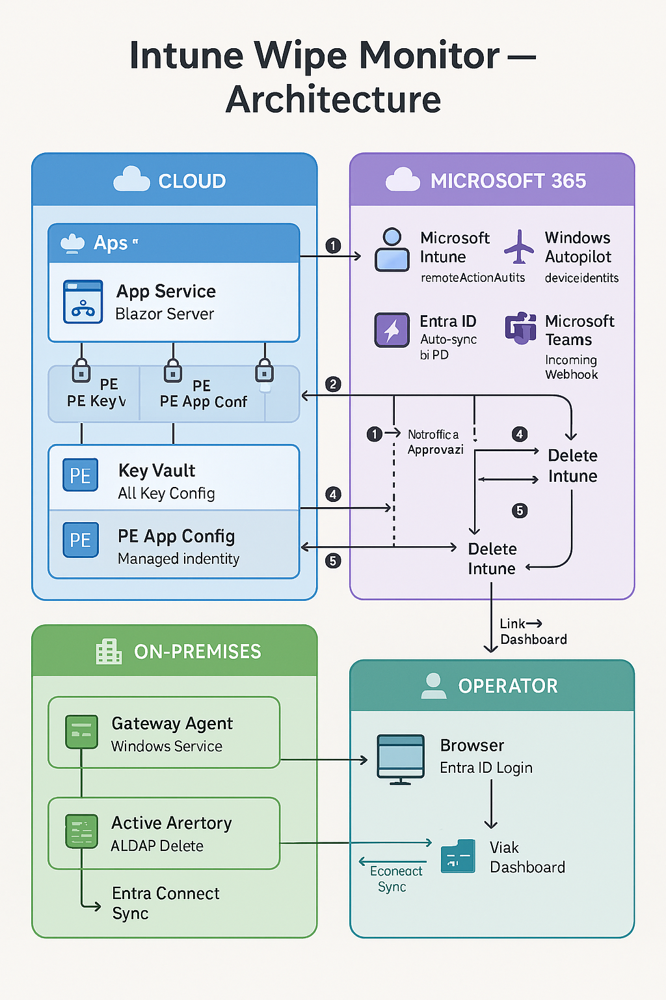

# Intune Wipe Monitor

[](LICENSE)
[](https://dotnet.microsoft.com/)
[](https://azure.microsoft.com)
[](https://learn.microsoft.com/graph/)
[](https://dotnet.microsoft.com/apps/aspnet/web-apps/blazor)
[](https://learn.microsoft.com/aspnet/core/signalr/)
[](https://learn.microsoft.com/azure/azure-monitor/app/app-insights-overview)
[](https://serilog.net/)

**Automated device lifecycle management after Intune wipe (factory reset) actions.**

Monitors Microsoft Intune for completed device wipe operations and orchestrates the cleanup of device objects from Autopilot, Active Directory, SCCM, and Intune — ensuring no device is removed until the wipe is confirmed as done. Sends Teams notifications for approval requests.

## Architecture



> 📐 Mermaid diagrams and sequence flow: [docs/architecture.md](docs/architecture.md)

## How It Works

1. **Polling** — A background service queries the Microsoft Graph API every 60 minutes (configurable):
   ```
   GET /beta/deviceManagement/remoteActionAudits?$filter=action eq 'factoryReset'
   ```
2. **Detection** — Devices with `actionState == "done"` are flagged as ready for cleanup
3. **Notification** — A Teams Adaptive Card is sent to the configured channel with device details and an "Approve" button
4. **Approval** — An operator reviews and approves the cleanup from the Blazor dashboard (Entra ID auth required)
5. **SID Cross-Validation** — Before any deletion, the agent validates the device identity across all systems:
   - Retrieves the computer **SID** (`objectSid`) from Active Directory
   - Retrieves the device **SID** from SCCM (`SMS_R_System.SID`)
   - Compares AD SID ↔ SCCM SID to ensure the same physical device
   - If SIDs don't match, the cleanup is **blocked** with a `SidMismatch` result
6. **Cleanup** — The orchestrator executes 4 steps in sequence:
   - **① Autopilot** → Graph API delete `windowsAutopilotDeviceIdentities` (cloud)
   - **② Active Directory** → LDAP delete via on-prem Gateway Agent (SignalR)
   - **③ SCCM** → AdminService REST delete via on-prem Gateway Agent (SignalR)
   - **④ Intune** → Graph API delete `managedDevices` (cloud)
   - **Entra ID** → Automatically cleaned up after AD sync
7. **Result Notification** — Teams card with cleanup result (✅ success / ❌ failure)
8. **Auditing** — Every action is tracked with custom Application Insights events, including matched SIDs

## Projects

| Project | Description |
|---|---|
| `Intune.WipeMonitor` | ASP.NET Core Blazor Server web app (Azure) |
| `Intune.WipeMonitor.Agent` | Worker Service / Windows Service (on-premises) |
| `Intune.WipeMonitor.Shared` | Shared models, contracts, enums, CMTrace formatter |

## Application Insights Custom Events

All cleanup operations emit structured custom events for auditing and monitoring:

| Event Name | When |
|---|---|
| `DeviceCleanup.Approved` | Operator approves a device cleanup |
| `DeviceCleanup.Skipped` | Operator skips a device |
| `DeviceCleanup.AutopilotDeletion` | Autopilot identity deletion attempted |
| `DeviceCleanup.ADDeletion` | AD object deletion attempted (emitted by both cloud and agent) |
| `DeviceCleanup.SCCMDeletion` | SCCM device deletion attempted (emitted by both cloud and agent) |
| `DeviceCleanup.IntuneDeletion` | Intune device deletion attempted |
| `DeviceCleanup.Completed` | Full cleanup completed successfully |
| `DeviceCleanup.Failed` | Cleanup failed on at least one target |
| `Agent.Connected` | On-prem agent connected to the hub |
| `Agent.Disconnected` | On-prem agent disconnected |
| `WipePoll.Completed` | Graph API polling cycle completed |
| `WipePoll.WipeDetected` | New completed wipe detected |

## SID Cross-Validation

The agent implements a safety chain to prevent accidental deletion of wrong devices:

```
CleanupCommand (device name + EntraDeviceId)
     │
     ▼
┌─────────────┐    objectSid     ┌─────────────┐
│  Active     │ ──────────────►  │  Compare    │
│  Directory  │    (LDAP)        │  AD SID     │
└─────────────┘                  │  vs         │
                                 │  SCCM SID   │──► Match? → Proceed with deletion
┌─────────────┐    SID           │             │──► Mismatch? → Block (SidMismatch)
│  SCCM       │ ──────────────►  │             │
│  AdminSvc   │   (REST)         └─────────────┘
└─────────────┘
```

- If **AD SID ≠ SCCM SID**: deletion is blocked, `StepResult.SidMismatch` is returned
- The matched SID is included in the `CleanupStepResult` for audit trail
- All SID validation results are logged in CMTrace format and tracked in Application Insights

**Example KQL queries:**

```kql
// All cleanup actions in the last 24h
customEvents
| where name startswith "DeviceCleanup"
| where timestamp > ago(24h)
| project timestamp, name, 
    DeviceName = tostring(customDimensions.DeviceName),
    Result = tostring(customDimensions.Result),
    Error = tostring(customDimensions.ErrorMessage)
| order by timestamp desc

// Failed deletions
customEvents
| where name in ("DeviceCleanup.ADDeletion", "DeviceCleanup.SCCMDeletion")
| where customDimensions.Result == "Failed"
| project timestamp, name,
    DeviceName = tostring(customDimensions.DeviceName),
    Error = tostring(customDimensions.ErrorMessage)
```

## Teams Notifications

When a wipe is completed and a device needs approval, an **Adaptive Card** is sent to a Microsoft Teams channel:

- 📢 **Approval request** — device name, owner, wipe date, "Open Approvals" button
- ✅/❌ **Cleanup result** — device name, who approved, success or failure

### Setup

1. In Teams, go to the target channel → **⋯** → **Workflows** → **"Post to a channel when a webhook request is received"**
2. Copy the generated URL (e.g. `https://prod-xx.westeurope.logic.azure.com:443/workflows/...`)
3. Set `WipeMonitor:TeamsWebhookUrl` in App Configuration or App Settings
4. Optionally set `WipeMonitor:DashboardUrl` for the button link in the card

> **Note**: The classic Incoming Webhook connector is being deprecated. Use the Power Automate Workflows approach. The Adaptive Card payload is identical for both.
> If no webhook URL is configured, notifications are silently skipped.

## Logging — CMTrace Format

Both the web app and the agent write log files in **CMTrace format** (`<![LOG[...]LOG]!>`), compatible with:
- **CMTrace.exe** (SCCM toolkit)
- **OneTrace** (Configuration Manager)

Logs are written to `logs/wipemonitor-web-YYYYMMDD.log` and `logs/wipemonitor-agent-YYYYMMDD.log` with automatic daily rolling and 30-day retention.

## Azure Infrastructure

| Resource | Purpose |
|---|---|
| App Service (B1 Linux) | Hosts the Blazor web app |
| Key Vault | Stores the Graph API client secret (private endpoint) |
| App Configuration | Stores all application settings with KV references (private endpoint) |
| Application Insights | Telemetry, custom events, and monitoring |
| VNet | Network isolation with two subnets |
| Private Endpoints | Key Vault and App Config accessible only via VNet |
| Managed Identity | Web app authenticates to Key Vault and App Config without secrets |

## Prerequisites

### Azure (Web App)
- An **App Registration** in Entra ID with:
  - `DeviceManagementManagedDevices.ReadWrite.All` (Application permission)
  - `DeviceManagementRBAC.Read.All` (Application permission)
- Client secret stored in Key Vault

### On-Premises (Agent)
- Windows machine with:
  - Network access to Active Directory (LDAP)
  - Network access to SCCM AdminService
  - Outbound HTTPS to Azure (for SignalR + App Insights)
- Domain account with permissions to delete computer objects in AD
- SCCM account with permissions to delete device records

## Configuration

### Web App (via Azure App Configuration)

| Key | Description |
|---|---|
| `WipeMonitor:PollingIntervalMinutes` | Polling interval (default: 60) |
| `WipeMonitor:RequireApproval` | Require manual approval (default: true) |
| `WipeMonitor:CleanupIntune` | Also delete from Intune (default: true) |
| `WipeMonitor:TeamsWebhookUrl` | Teams Incoming Webhook URL (optional) |
| `WipeMonitor:DashboardUrl` | Dashboard URL for Teams card links |
| `Graph:TenantId` | Azure AD tenant ID |
| `Graph:ClientId` | App Registration client ID |
| `Graph:ClientSecret` | Key Vault reference to the client secret |

### Agent (`appsettings.json`)

```json
{
  "ApplicationInsights": {
    "ConnectionString": "<connection-string>"
  },
  "Agent": {
    "AgentId": "AGENT-01",
    "HubUrl": "https://intune-wipemonitor-app.azurewebsites.net/hub/cleanup",
    "HeartbeatIntervalSeconds": 60,
    "ActiveDirectory": {
      "Server": "dc01.contoso.com",
      "SearchBase": "DC=contoso,DC=com",
      "Port": 389
    },
    "Sccm": {
      "AdminServiceUrl": "https://sccm-server.contoso.com/AdminService"
    }
  }
}
```

## Getting Started

### Build

```bash
dotnet build
```

### Run locally (development)

```bash
# Web App
cd src/Intune.WipeMonitor
dotnet run

# Agent (separate terminal)
cd src/Intune.WipeMonitor.Agent
dotnet run
```

### Install Agent as Windows Service

```powershell
sc.exe create "Intune.WipeMonitor.Agent" binpath="C:\Agent\Intune.WipeMonitor.Agent.exe"
sc.exe start "Intune.WipeMonitor.Agent"
```

### Deploy Web App to Azure

```bash
cd src/Intune.WipeMonitor
dotnet publish -c Release -o publish
Compress-Archive -Path publish/* -DestinationPath publish.zip
az webapp deploy --name intune-wipemonitor-app -g IntuneWipeMonitor-RG --src-path publish.zip --type zip
```

## License

MIT
