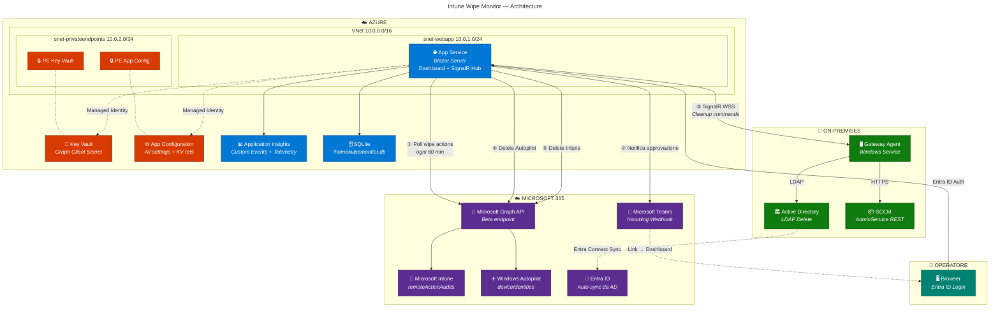
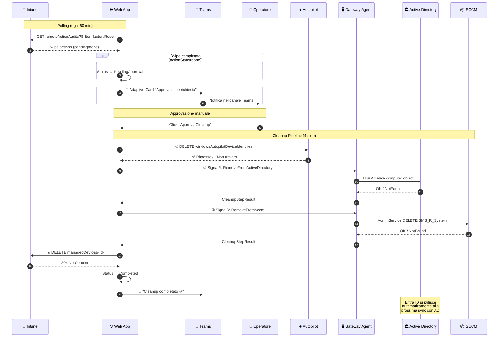

```mermaid
---
title: Intune Wipe Monitor — Architecture
---
graph TB
    subgraph CLOUD["☁️ AZURE"]
        subgraph VNET["VNet 10.0.0.0/16"]
            subgraph WEBAPP_SUBNET["snet-webapp 10.0.1.0/24"]
                APP["🌐 App Service<br/><i>Blazor Server</i><br/>Dashboard + SignalR Hub"]
            end
            subgraph PE_SUBNET["snet-privateendpoints 10.0.2.0/24"]
                PE_KV["🔒 PE Key Vault"]
                PE_AC["🔒 PE App Config"]
            end
        end

        KV["🔑 Key Vault<br/><i>Graph Client Secret</i>"]
        AC["⚙️ App Configuration<br/><i>All settings + KV refs</i>"]
        AI["📊 Application Insights<br/><i>Custom Events + Telemetry</i>"]
        DB["🗄️ SQLite<br/><i>/home/wipemonitor.db</i>"]
        
        PE_KV -.- KV
        PE_AC -.- AC
        APP --> AI
        APP --> DB
        APP -.->|"Managed Identity"| KV
        APP -.->|"Managed Identity"| AC
    end

    subgraph MICROSOFT["☁️ MICROSOFT 365"]
        INTUNE["📱 Microsoft Intune<br/><i>remoteActionAudits</i>"]
        AUTOPILOT["✈️ Windows Autopilot<br/><i>deviceIdentities</i>"]
        ENTRA["🔐 Entra ID<br/><i>Auto-sync da AD</i>"]
        GRAPH["📡 Microsoft Graph API<br/><i>Beta endpoint</i>"]
        TEAMS["💬 Microsoft Teams<br/><i>Incoming Webhook</i>"]
        
        GRAPH --> INTUNE
        GRAPH --> AUTOPILOT
    end

    subgraph ONPREM["🏢 ON-PREMISES"]
        AGENT["🖥️ Gateway Agent<br/><i>Windows Service</i>"]
        AD["🏛️ Active Directory<br/><i>LDAP Delete</i>"]
        SCCM["📦 SCCM<br/><i>AdminService REST</i>"]
        
        AGENT -->|"LDAP"| AD
        AGENT -->|"HTTPS"| SCCM
    end

    subgraph OPERATOR["👤 OPERATORE"]
        BROWSER["🖥️ Browser<br/><i>Entra ID Login</i>"]
    end

    %% Connections
    APP -->|"① Poll wipe actions<br/><i>ogni 60 min</i>"| GRAPH
    APP -->|"② Notifica approvazione"| TEAMS
    APP <-->|"③ SignalR WSS<br/><i>Cleanup commands</i>"| AGENT
    APP -->|"④ Delete Autopilot"| GRAPH
    APP -->|"⑤ Delete Intune"| GRAPH
    AD -.->|"Entra Connect Sync"| ENTRA

    BROWSER -->|"Entra ID Auth"| APP
    TEAMS -.->|"Link → Dashboard"| BROWSER

    classDef azure fill:#0078d4,stroke:#005a9e,color:white
    classDef ms365 fill:#5c2d91,stroke:#3b1d60,color:white
    classDef onprem fill:#107c10,stroke:#0b5a0b,color:white
    classDef security fill:#d83b01,stroke:#a02d01,color:white
    classDef operator fill:#008272,stroke:#005c52,color:white

    class APP,DB,AI azure
    class KV,PE_KV,AC,PE_AC security
    class INTUNE,AUTOPILOT,ENTRA,GRAPH,TEAMS ms365
    class AGENT,AD,SCCM onprem
    class BROWSER operator
```

## Cleanup Flow

```mermaid
sequenceDiagram
    autonumber
    participant I as 📱 Intune
    participant W as 🌐 Web App
    participant T as 💬 Teams
    participant O as 👤 Operatore
    participant A as ✈️ Autopilot
    participant G as 🖥️ Gateway Agent
    participant AD as 🏛️ Active Directory
    participant S as 📦 SCCM

    Note over I,W: Polling (ogni 60 min)
    W->>I: GET remoteActionAudits?$filter=factoryReset
    I-->>W: wipe actions (pending/done)
    
    alt Wipe completato (actionState=done)
        W->>W: Status → PendingApproval
        W->>T: 📢 Adaptive Card "Approvazione richiesta"
        T-->>O: Notifica nel canale Teams
    end

    Note over O,W: Approvazione manuale
    O->>W: Click "Approva Cleanup"
    
    Note over W,S: Cleanup Pipeline (4 step)
    W->>A: ① DELETE windowsAutopilotDeviceIdentities
    A-->>W: ✅ Rimosso / ℹ️ Non trovato

    W->>G: ② SignalR: RemoveFromActiveDirectory
    G->>AD: LDAP Delete computer object
    AD-->>G: OK / NotFound
    G-->>W: CleanupStepResult

    W->>G: ③ SignalR: RemoveFromSccm
    G->>S: AdminService DELETE SMS_R_System
    S-->>G: OK / NotFound
    G-->>W: CleanupStepResult

    W->>I: ④ DELETE managedDevices/{id}
    I-->>W: 204 No Content

    W->>W: Status → Completed
    W->>T: 📢 "Cleanup completato ✅"
    
    Note over AD: Entra ID si pulisce<br/>automaticamente alla<br/>prossima sync con AD
```
